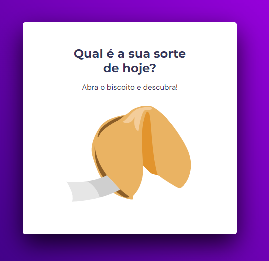

<h1 align="center"> Stage 5 - Avançando no JavaScript - Desafio Extra - Biscoito da Sorte 🚀 </h1>

  <a href="#-tecnologias">Tecnologias</a>&nbsp;&nbsp;&nbsp;|&nbsp;&nbsp;&nbsp;
  <a href="#-projeto">Projeto</a>&nbsp;&nbsp;&nbsp;|&nbsp;&nbsp;&nbsp;
  <a href="#-layout">Layout</a>&nbsp;&nbsp;&nbsp;|&nbsp;&nbsp;&nbsp;
  <a href="#memo-licença">Licença</a>

 

  

## 🚀 Tecnologias

Esse projeto foi desenvolvido com as seguintes tecnologias:

- HTML e CSS
- Java Script
- Git e Github
- Figma

## 💻 Projeto

Neste desafio foi criado um jogo chamado Biscoito da Sorte, no qual o usuário, **a partir de um clique ou enter**, abre um biscoito com a sua sorte do dia. Foi aplicado vários conhecimentos adquiridos, entre eles:

- Estrutura de dados HTML
- Animações com CSS
- Funções no Javascript
- Manipulação da DOM
- Biblioteca JS Math()
- Funções *callback*
- Arrays

## 🔖 Layout

Você pode visualizar o layout do projeto através [DESSE LINK](https://www.figma.com/file/ymVwbooTA1l4CABHRtxVJe/Biscoito-da-Sorte-(Community)?node-id=0%3A1&t=KCFKwYsqlL9PXmwR-0). É necessário ter conta no [Figma](https://figma.com) para acessá-lo.

## :memo: Licença

Esse projeto está sob a licença MIT.

---

Feito com  ♥  by Alex Lima

Você pode acessar o Website do projeto através do link: 
<a href= "https://alima07.github.io/rocketseat-stage5-desafio-biscoito-da-sorte/" target="_blank"> Clique aqui ⏯ </a>

